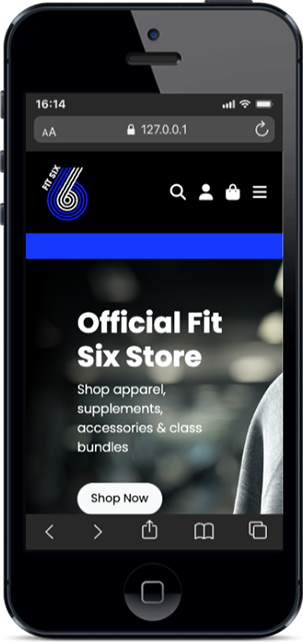
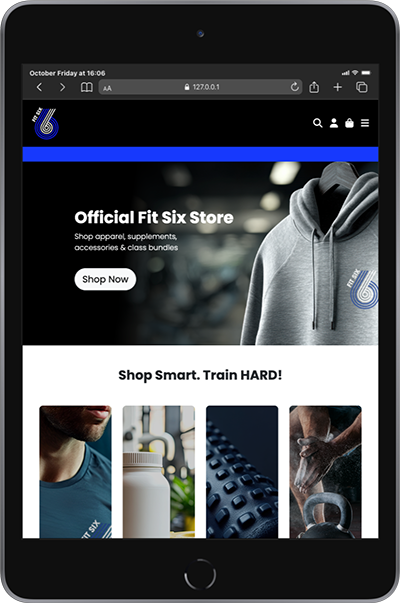

# Fit Six – Testing

> [!NOTE]  
> Return to the main [README.md](README.md) file.

This document outlines the testing strategy, process, and results for the **Fit Six Store** e-commerce application. It verifies that the site’s core functionality operates correctly across all user roles, provides a responsive and accessible experience, and meets the acceptance criteria defined by the project’s user stories and feature plan.

Both **manual and automated testing** were conducted throughout development, covering functionality, responsiveness, browser compatibility, accessibility, and data validation. Django’s built-in test framework was used for backend testing, while real-device and browser tools were used to assess front-end behaviour.

This file includes:
- User story-based test cases  
- Manual testing across devices and browsers  
- Automated unit tests (Django views, forms, models)  
- HTML, CSS, Python, and accessibility validation  
- Bug tracking and fixes  
- Known issues (if any)

---

- [VALIDATION TESTING](#validation-testing)
  - [W3C Validator](#w3c-validation)
  - [W3C CSS Validator](#css-validation)
  - [JavaScript Validator](#js-validation)
  - [Python Validator](#python-validation)
  - [Lighthouse](#lighthouse)
- [AUTOMATED TESTING](#automated-testing)
- [MANUAL TESTING](#manual-testing)
  - [Full Testing](#full-testing)
  - [Browser Compatibility](#browser)
  - [Responsiveness](#responsiveness)
  - [Accessibility](#accessibility)
  - [Testing User Stories](#user-story-testing)
  - [Features Testing](#features-testing)
  - [Manual Features Testing](#manual-features-testing)
  - [Solved Issues & Bugs](#solved-issues)
  - [Known Issues & Bugs](#known-issues)
  - [Conclusion](#conclusion)

 

Testing was an **essential part of the Fit Six development workflow**, ensuring that the application remained **robust, responsive, and user-friendly** at every stage. Continuous testing allowed issues to be identified and resolved early, improving both development efficiency and overall site reliability.

A range of tools and methods were employed to validate the site’s functionality and presentation. **Chrome Developer Tools** were used extensively to test responsiveness, inspect layout behaviour, debug JavaScript interactions, and assess performance under different viewport sizes. These tools proved invaluable for tuning the user experience across devices.

**ChatGPT** was used throughout the project to support testing strategies, clarify Django logic, refine user journeys, and improve the accessibility and clarity of interface elements. This assisted in building maintainable, production-ready code and supported critical thinking during test planning and debugging.

To confirm that the site was **responsive and accessible across all modern devices**, every page and interactive element was manually tested using Chrome’s responsive design mode, as well as physical testing on **desktop monitors, laptops, tablets, and smartphones**. Navigation, forms, and key e-commerce flows were verified at various screen sizes to ensure a **seamless and consistent experience** for all users.

---

## Validation Testing

### W3C Validator

The [W3C Markup Validation Service](https://validator.w3.org/) was used to check the **HTML and CSS** output across all key pages of the Fit Six site. Because Django templates include dynamic content and logic tags (e.g. ``, `{{ }}`), the validator was run against the **fully rendered HTML output** by viewing the page source in the browser and pasting that into the validator.

This ensured the final output — as seen by users and browsers — conformed to HTML5 and CSS3 standards.

| Page Tested              | Result | Evidence |
|--------------------------|--------|----------|
| Home                     | Pass   | [Home Page Validation](documentation/testing/validation/w3c-home.webp) |
| Products (All)           | Pass   | [Products Page Validation](documentation/testing/validation/w3c-products.webp) |
| Product Detail           | Pass   | [Product Detail Validation](documentation/testing/validation/w3c-product-detail.webp) |
| Shopping Bag             | Pass   | [Bag Page Validation](documentation/testing/validation/w3c-bag.webp) |
| Checkout                 | Pass   | [Checkout Page Validation](documentation/testing/validation/w3c-checkout.webp) |
| Checkout Success         | Pass   | [Checkout Success Validation](documentation/testing/validation/w3c-checkout-success.webp) |
| User Profile             | Pass   | [Profile Page Validation](documentation/testing/validation/w3c-profile.webp) |
| Terms & Conditions       | Pass   | [Terms Page Validation](documentation/testing/validation/w3c-terms.webp) |
| Privacy Policy           | Pass   | [Privacy Policy Validation](documentation/testing/validation/w3c-privacy.webp) |
| Shipping Policy          | Pass   | [Shipping Page Validation](documentation/testing/validation/w3c-shipping.webp) |
| 400 Error Page           | Pass   | [400 Page Validation](documentation/testing/validation/w3c-400.webp) |
| 403 Error Page           | Pass   | [403 Page Validation](documentation/testing/validation/w3c-403.webp) |
| 404 Error Page           | Pass   | [404 Page Validation](documentation/testing/validation/w3c-404.webp) |
| 500 Error Page           | Pass   | [500 Page Validation](documentation/testing/validation/w3c-500.webp) |

---

### CSS Validator

[CSS W3C Validator](https://jigsaw.w3.org/css-validator/) was used to validate my CSS file.

| File tested | Result | Evidence |
| :--- | :--- | :---: |
| static/base.css | Pass | [static/base.css validation](documentation/testing/validation/w3c-base-css.webp) |
| checkout/static/checkout/css/checkout.css | Pass | [checkout.css validation](documentation/testing/validation/w3c-checkout-css.webp) |
| profiles/static/profiles/css/profile.css | Pass | [profile.css validation](documentation/testing/validation/w3c-profile-css.webp) |

---

### JavaScript

All JavaScript was validated using [JSHint](https://jshint.com/) to ensure proper syntax, code quality, and adherence to best practices.

| File tested | Result | Evidence | Notes |
| ----------- | ------ | -------- | ----- |
| checkout/static/checkout/js/stripe-elements.js | Pass | [stripe-elements.js](documentation/testing/validation/javascript-stripe-elements.webp) | There were 2 initial warnings -  'template literal syntax' is only available in ES6 (use 'esversion: 6'). I updated the JSHint configuration to ES8 using this code `/*jshint esversion: 8 */`. |
| profiles/static/profiles/js/countryfield.js | Pass |[countryfield.js](documentation/testing/validation/javascript-countryfield.webp) |

---

### Python Validator

All Python code was validated using the [Code Institute Python Linter](https://pep8ci.herokuapp.com/), which checks for compliance with PEP8 — the official Python style guide. This ensured consistent, readable, and well-structured code throughout the project.

| File | Result | Evidence |
| :--- | :--- | :---: |
| **fitsix_project** |
| fitsix_project/settings.py | Pass | [settings.py validation](documentation/testing/validation/python-settings.webp) |
| fitsix_project/urls.py | Pass | [urls.py validation](documentation/testing/validation/python-fitsix-urls.webp) |
| **BAG** |
| bag/apps.py | Pass | [apps.py validation](documentation/testing/validation/python-bag-apps.webp) |
| bag/contexts.py | Pass | [contexts.py validation](documentation/testing/validation/python-bag-contexts.webp) |
| bag/urls.py | Pass | [urls.py validation](documentation/testing/validation/python-bag-urls.webp) |
| bag/views.py | Pass | [views.py validation](documentation/testing/validation/python-bag-views.webp) |
| bag/templatetags/bag_tools.py | Pass | [bag_tools.py validation](documentation/testing/validation/python-bag-tools.webp) |
| bag/bag_extras.py | Pass | [bag_extras.py validation](documentation/testing/validation/python-bag-extras.webp) |
| **CHECKOUT** |
| checkout/admin.py | Pass | [admin.py validation](documentation/testing/validation/python-checkout-admin.webp) |
| checkout/apps.py | Pass | [apps.py validation](documentation/testing/validation/python-checkout-apps.webp) |
| checkout/forms.py | Pass | [forms.py validation](documentation/testing/validation/python-checkout-forms.webp) |
| checkout/models.py | Pass | [models.py validation](documentation/testing/validation/python-checkout-models.webp) |
| checkout/signals.py | Pass | [signals.py validation](documentation/testing/validation/python-checkout-signals.webp) |
| checkout/urls.py | Pass | [urls.py validation](documentation/testing/validation/python-checkout-urls.webp) |
| checkout/views.py | Pass | [views.py validation](documentation/testing/validation/python-checkout-views.webp) |
| checkout/webhook_handler.py | Pass | [webhook_handler.py validation](documentation/testing/validation/python-checkout-handler.webp) |
| checkout/webhooks.py | Pass | [webhooks.py validation](documentation/testing/validation/python-checkout-webhooks.webp) |
| checkout/tests/test_forms.py | Pass | [test_forms.py validation](documentation/testing/validation/python-checkout-forms-test.webp) |
| checkout/tests/test_models.py | Pass | [test_models.py validation](documentation/testing/validation/python-checkout-models-test.webp) |
| checkout/tests/test_views.py | Pass | [test_views.py validation](documentation/testing/validation/python-checkout-views-test.webp) |
| checkout/tests/test_webhook_handler.py | Pass | [test_webhook_handler.py validation](documentation/testing/validation/python-checkout-webhook-handler-test.webp) |
| checkout/tests/test_webhooks.py | Pass | [test_webhooks.py validation](documentation/testing/validation/python-checkout-webhooks-test.webp) |
| **HOME** |
| home/apps.py | Pass | [apps.py validation](documentation/testing/validation/python-home-apps.webp) |
| home/urls.py | Pass | [urls.py validation](documentation/testing/validation/python-home-urls.webp) |
| home/views.py | Pass | [views.py validation](documentation/testing/validation/python-home-views.webp) |
| **PRODUCTS** |
| products/admin.py | Pass | [admin.py validation](documentation/testing/validation/python-products-admin.webp) |
| products/apps.py | Pass | [apps.py validation](documentation/testing/validation/python-products-apps.webp) |
| products/forms.py | Pass | [forms.py validation](documentation/testing/validation/python-products-forms.webp) |
| products/models.py | Pass | [models.py validation](documentation/testing/validation/python-products-models.webp) |
| products/urls.py | Pass | [urls.py validation](documentation/testing/validation/python-products-urls.webp) |
| products/views.py | Pass | [views.py validation](documentation/testing/validation/python-products-views.webp) |
| products/widgets.py | Pass | [widgets.py validation](documentation/testing/validation/python-products-widgets.webp) |
| products/test_admin.py | Pass | [test_admin.py validation](documentation/testing/validation/python-products-admin-test.webp) |
| products/test_forms.py | Pass | [test_forms.py validation](documentation/testing/validation/python-products-forms-test.webp) |
| products/test_models.py | Pass | [test_models.py validation](documentation/testing/validation/python-products-models-test.webp) |
| products/test_views.py | Pass | [test_views.py validation](documentation/testing/validation/python-products-views-test.webp) |
| **PROFILES** |
| profiles/apps.py | Pass | [apps.py validation](documentation/testing/validation/python-profiles-apps.webp) |
| profiles/forms.py | Pass | [forms.py validation](documentation/testing/validation/python-profiles-forms.webp) |
| profiles/models.py | Pass | [models.py validation](documentation/testing/validation/python-profiles-models.webp) |
| profiles/urls.py | Pass | [urls.py validation](documentation/testing/validation/python/profiles-urls-validation.png) |
| profiles/views.py | Pass | [views.py validation](documentation/testing/validation/python-profiles-views.webp) |
| profiles/test_forms.py | Pass | [test_forms.py validation](documentation/testing/validation/python-profiles-forms-test.webp) |
| profiles/test_models.py | Pass | [test_models.py validation](documentation/testing/validation/python-profiles-models-test.webp) |
| profiles/test_views.py | Pass | [test_views.py validation](documentation/testing/validation/python-profiles-views-test.webp) |
| **NEWSLETTER** |
| newsletter/admin.py | Pass | [admin.py validation](documentation/testing/validation/python-newsletter-admin.webp) |
| contact/apps.py | Pass | [apps.py validation](documentation/testing/validation/python-newsletter-apps.webp) |
| contact/forms.py | Pass | [forms.py validation](documentation/testing/validation/python-newsletter-forms.webp) |
| contact/models.py | Pass | [models.py validation](documentation/testing/validation/python-newsletter-models.webp) |
| contact/urls.py | Pass | [urls.py validation](documentation/testing/validation/python-newsletter-urls.webp) |
| contact/views.py | Pass | [views.py validation](documentation/testing/validation/python-newsletter-views.webp) |
| contact/test_forms.py | Pass | [test_forms.py validation](documentation/testing/validation/python-newsletter-forms-test.webp) |
| contact/test_models.py | Pass | [test_models.py validation](documentation/testing/validation/python-newsletter-models-test.webp) |
| contact/test_views.py | Pass | [test_views.py validation](documentation/testing/validation/python-newsletter-views-test.webp) |

---

### Lighthouse

I've tested my deployed project using the Lighthouse Audit tool to test the performance, accessibility, best practices and SEO of the website.

---

## Automated Testing

Automated testing was a key part of the development workflow for **Fit Six**, helping to ensure that critical components of the e-commerce site functioned reliably under various user scenarios. The test suite covers **models, forms, views, and admin logic** using Django’s built-in [TestCase](https://docs.djangoproject.com/en/4.2/topics/testing/overview/) framework.

[coverage.py](https://pypi.org/project/coverage/) was used to monitor test coverage and identify any untested areas. The goal was to validate backend functionality, prevent regressions, and support a maintainable codebase as the project scaled in complexity.

### Scope of Automated Testing

The automated test suite was planned and executed to cover the following key areas:

#### Checkout App

- **Form logic** tested for placeholder population, required field indicators, autofocus, CSS class assignment, and label suppression in `OrderForm`.  
- **Model logic** tested for accurate total, discount, and delivery cost calculations in `Order`, plus readable string output for both `Order` and `OrderLineItem` models.  
- **View logic** tested for checkout flow behavior including form rendering, Stripe integration context, redirects on empty bag, order success handling, and error message feedback for invalid submissions.  
- **Webhook and handler logic** tested to ensure correct processing of Stripe webhook events — including order creation, profile updates, email confirmations, and error handling for invalid payloads, signatures, and failed payments.

#### Newsletter App

- **Form logic** tested to validate unique email submissions and reject duplicates
- **Model logic** tested for email uniqueness, optional user linking, and string output
- **View logic** tested for success, warning, and error message feedback with redirects

#### Products App

- **Model logic** tested for string representations of `Product`, `ProductVariant`, and `Category`, plus relationships and default field values  
- **Form logic** tested for validation of both `ProductForm` and `ProductVariantForm`, including required fields and category dropdown customization  
- **View logic** tested for product listing, search, sorting, filtering, detail pages, and admin-only access to add/edit/delete views with form validation  
- **Admin configuration** tested to confirm model registration, `list_display`, `search_fields`, `readonly_fields`, inline variant support, and image preview functionality

#### Profiles App

- **Model logic** tested to confirm automatic `UserProfile` creation via Django signals, correct string representation, field defaults, and update persistence  
- **Form logic** tested to verify field validation, placeholder and CSS class rendering, autofocus behavior, and label suppression in `UserProfileForm`  
- **App configuration** verified to ensure proper `AppConfig` registration and name resolution

#### Tools Used

| Tool | Purpose |
| ---- | ------- |
| Django TestCase | Core unit and integration test framework |
| Client() | Simulates authenticated and anonymous users |
| coverage.py | Measures line and branch coverage |
| htmlcov/ | Visual review of missed lines and test quality |

#### Coverage Testing

Test coverage was monitored using `coverage.py`, with line-by-line analysis used to identify and close gaps. Edge cases, such as admin-only views, error handling in checkout, and model method branches (e.g., slugs, totals, and discounts), were explicitly tested. All core business logic — from browsing and purchasing to profile management — was thoroughly covered and validated.

| Coverage for | Total | Evidence |
| :---| :--- | :--- |
| Bag | **74%** | [Coverage Bag](documentation/testing/validation/coverage-bag.webp) |
| Checkout | **90%** | [Coverage Checkout](documentation/testing/validation/coverage-checkout.webp)|
| Home | **100%** | [Coverage Home](documentation/testing/validation/coverage-home.png) |
| Newsletter | **100%** | [Coverage Contact](documentation/testing/validation/coverage-newsletter.webp) |
| Products | **97%** | [Coverage Products](documentation/testing/validation/coverage-products.webp) |
| Profiles | **94%**  | [Coverage Profiles](documentation/testing/validation/coverage-profiles.webp) |

#### Edge Cases Covered
- Submitting forms with missing, invalid, or out-of-range product or checkout data
- Attempting to add a product without a name or category (invalid)
- Sorting and filtering products with multiple query parameters
- Viewing checkout or profile pages as unauthenticated users
- Attempting to edit or delete products as a non-admin user
- Rendering views with no products or order history (empty states)
- Handling missing or broken product/variant images in the admin panel
- Custom 404 handling for invalid product slugs or broken URLs

### Summary

This comprehensive automated test suite ensures that **Fit Six** is stable, secure, and reliable. It enabled fast development cycles with confidence, catching regressions early and validating critical user and admin workflows throughout the app.

--

## Manual Testing

### Full Testing

This section outlines the **manual testing** conducted to ensure the Fit Six e-commerce application functions correctly across all major user interactions, devices, and screen sizes. Testing focused on key areas such as form validation, navigation flows, user authentication, responsive layout behaviour, and secure checkout processes.

Each feature was tested systematically to identify and resolve potential issues relating to layout, business logic, error handling, or access control. Special attention was paid to high-impact views such as the **product catalogue**, **shopping bag**, **checkout**, and **user account dashboard**.

In addition to structured manual testing, **informal feedback** was gathered from friends and family using a variety of devices and browsers. This helped validate the real-world usability, responsiveness, and accessibility of the site across different screen sizes and operating systems.

### Browser Compatibility

To ensure broad accessibility and a consistent user experience, the **Fit Six** application was manually tested on all major modern browsers, including:

- [Google Chrome](https://www.google.com/chrome)
- [Mozilla Firefox](https://www.mozilla.org/firefox)
- [Apple Safari](https://www.apple.com/uk/safari/)
- [Microsoft Edge](https://www.microsoft.com/en-gb/edge)

Each page and core user flow (e.g. registration, product filtering, cart interaction, and checkout) was tested for rendering consistency, interactive behaviour, and layout responsiveness.

---

### Responsiveness

To ensure a consistent user experience across all devices, the Fit Six site was thoroughly tested for responsiveness using **Chrome Developer Tools** and physical testing on smartphones, tablets, laptops, and desktops.

Based on research from [Stack Exchange](https://ux.stackexchange.com/questions/74798/are-there-devices-narrower-than-320px-and-data-on-their-usage-for-web-browsing), testing was anchored at a minimum width of **320px**, which reflects the narrowest modern screen size still in common use.

In addition to using Chrome’s responsive design mode, the [Mobile First](https://www.webmobilefirst.com/en/) Chrome extension was used to simulate how the site renders across various devices and breakpoints.

#### Mobile Devices

| Device tested | Screen Width (px) | Screen Height (px) | Result | Notes (Issues Found) |
| :---: | :---: | :---: | :---: | :---: |
| iPhone 5  | iPhone 12/13/14  | Google Pixel 8  | iPhone 16 Pro Max  |
| iPhone 5 | 320px | 568px | ✅ Pass | 🛠️ Removed background image and filled screen with panel |
| iPhone 12/13/14 | 390px | 844px | ✅ Pass | 🛠️ Set info panel to hidden when other panels are visible |
| Google Pixel 8 | 412px | 916px | ✅ Pass | 🛠️ Set info panel to hidden when other panels are visible |
| iPhone 16 Pro Max | 440px | 956px | ✅ Pass | 🛠️ Set info panel to hidden when other panels are visible |

#### Tablets

| Device tested | Screen Width (px) | Screen Height (px) | Result | Notes (Issues Found) |
| :---: | :---: | :---: | :---: | :---: |
| iPad Mini  | Galaxy Tab S7  | iPad Pro 11  | | |
| iPad Mini | 768px | 1024px | ✅ Pass | 🛠️ Decreased margin spacing to improve UI |
| Galaxy Tab S7 | 800px | 1280px | ✅ Pass | 🛠️ Decreased margin spacing to improve UI |
| iPad Pro 11 | 834px | 1194px | ✅ Pass | 🛠️ Decreased margin spacing to improve UI |

#### Laptops & Desktops

| Device tested | Screen Width (px) | Screen Height (px) | Result | Notes (Issues Found) |
| :---: | :---: | :---: | :---: | :---: |
| MacBook Air 13”  | Dell Latitude  | Macbook Pro 16"  | iMac 24"  | Full HD monitor  |
| MacBook Air 13” | 1280px | 800px | ✅ Pass | ✅ Fully responsive |
| Dell Latitude | 1440px | 809px | ✅ Pass | ✅ Fully responsive |
| Macbook Pro 16" | 1728px | 1085px | ✅ Pass | ✅ Fully responsive |
| iMac 24" | 2048px | 1142px | ✅ Pass | ✅ Fully responsive |
| Full HD monitor | 1920px  | 1080px | ✅ Pass | ✅ Fully responsive |

---

### Accessibility

Accessibility was a key consideration throughout the development of **Fit Six**, to ensure the site is usable by people of all abilities and assistive needs. The goal was to meet **WCAG 2.1 AA** standards where possible, particularly for navigation, colour contrast, and form usage.

#### Colour Contrast Compliance

To support users with visual impairments, all key colour combinations (text, buttons, backgrounds) were tested using the [WebAIM Contrast Checker](https://webaim.org/resources/contrastchecker/). This ensured that foreground and background combinations meet or exceed recommended contrast ratios for legibility.

In addition, form labels, alt attributes, and ARIA roles were reviewed to improve screen reader compatibility and keyboard accessibility.

| Foreground colour | Background colour | Screenshot | Testing results |
| :-----------------: | :-----------------: | :---------------: | :---------------: |
| `#1739FD`         | `#000000`         | | ⛔️ Fail on normal text   ✅  Pass on larger text and graphics |
| `#1739FD`         | `#ffffff`         | | ✅ Pass |
| `#000000`         | `#dddddd`         | | ✅ Pass |
| `#dc3545`         | `#ffffff`         | | ✅ Pass |
| `#198754`         | `#ffffff`         | | ✅ Pass |

---

### Testing User Stories

### Testing User Stories

| User Story ID | As a/an       | I want to be able to ...                              | So that I can...                                       | How is this achieved? | Evidence |
|---------------|---------------|--------------------------------------------------------|--------------------------------------------------------|------------------------|----------|
| **Viewing and Navigation** | | | | | |
| 1             | Guest          | Easily navigate the site                              | Find gym merchandise and information quickly           | Responsive navigation, structured layout, and intuitive page links | |
| 2             | Guest          | View a list of product categories                     | Browse items by type (e.g. apparel, supplements)       | Homepage and nav show category cards and links to filtered product views | |
| 3             | Shopper        | View detailed product information                     | Decide if the item meets my needs                      | Product detail page shows sizes, colours, price, and images | |
| 4             | Shopper        | View my cart at any time                              | Track what I plan to purchase                          | Bag icon updates in real-time and links to bag summary page | |
| 5             | Shopper        | See my cart total update in real-time                 | Track spending and avoid surprises at checkout         | AJAX cart updates, mini bag on add-to-cart actions | |
| 6             | Shopper        | Access the site easily on mobile                      | Shop from any device conveniently                      | Fully responsive design with mobile-first layout and off-canvas nav | |
| **Registration & Accounts** | | | | | |
| 7             | Guest          | Register for an account                               | Make purchases and view order history                  | Custom Allauth templates with signup form | |
| 8             | Shopper        | Receive confirmation after registering                | Know that my account is active                         | Success message and email confirmation (optional) | |
| 9             | Shopper        | Log in and log out securely                           | Access my private information safely                   | Secure login/logout with redirect and CSRF protection | |
| 10            | Shopper        | View and update my profile                            | Change delivery address and personal info              | Profile page with update form and validation | |
| 11            | Shopper        | View my previous orders                               | Track what I’ve bought and reorder easily              | Order history in profile, with links to past order receipts | |
| 12            | Shopper        | Reset my password                                     | Recover account access if I forget credentials         | Allauth password reset flow with secure token emails | |
| **Searching & Filtering** | | | | | |
| 13            | Guest          | Filter products by category or type                   | Quickly narrow down my search                          | Category sidebar and query param filtering | |
| 14            | Guest          | Search for a product by name or keyword               | Find specific items faster                             | Search bar with Q object matching against name and description | |
| 15            | Shopper        | Sort products by price, name, or popularity           | Choose the most relevant or affordable options         | Sort dropdown updates results via query params | |
| **Cart & Checkout** | | | | | |
| 16            | Shopper        | Add items to my cart                                  | Save products I intend to buy                          | Add to cart button with size/colour selection | |
| 17            | Shopper        | Adjust quantities or remove items from cart           | Finalise exactly what I want to purchase               | Bag summary page allows quantity changes and deletions | |
| 18            | Shopper        | Proceed to a secure checkout                          | Buy items with confidence                              | Stripe integration, CSRF-protected forms | |
| 19            | Guest/Shopper  | Checkout with or without an account                  | Make quick purchases when needed                       | Guest checkout enabled via session bag and order | |
| 20            | Shopper        | Enter payment details easily                          | Complete my order smoothly                             | Stripe card input with custom style, instant validation | |
| 21            | Shopper        | Receive on-screen and email confirmation              | Ensure the order was successful                        | Checkout success page and order confirmation email | |
| 22            | Shopper        | Know that my data is protected                        | Trust the site and continue using it                   | HTTPS, Stripe, and secure session handling | |
| **Admin & Store Management** | | | | | |
| 23            | Admin          | Add new products to the store                         | Keep the shop up to date with new items                | Admin panel product + variant forms with preview | |
| 24            | Admin          | Edit or update product info                           | Correct mistakes or make improvements                  | Admin panel and edit views for products | |
| 25            | Admin          | Delete a product                                      | Remove items that are no longer for sale               | Delete button in product admin and confirmation modal | |
| 26            | Admin          | Monitor and manage product stock                      | Ensure products don’t oversell                         | Stock is managed at variant level and updated per order | |
| 27            | Admin          | View and manage incoming orders                       | Fulfil customer purchases efficiently                  | Orders visible in Django admin with line item breakdowns | |
| 28            | Admin          | Access the admin panel securely                       | Manage store operations without public access          | Admin login via Django admin with superuser access only | |
| **Experience & Compliance** | | | | | |
| 29            | All users      | View accessibility-friendly content                   | Navigate the site with any device or ability           | Contrast-checked colour palette, semantic HTML, alt text on images | |
| 30            | All users      | Receive clear feedback when something goes wrong      | Know how to fix errors and complete actions            | Flash messages and form validation feedback | |
| 31            | All users      | Contact the store via a form                          | Ask questions or report issues                         | Contact form with success/error messaging | |
| 32            | All users      | Read Terms & Conditions and Privacy Policy            | Understand how my data is used and my rights           | Dedicated privacy.html and terms.html pages, linked in footer | |

> [!NOTE]
> User stories can also be viewed in the [README](README.md) file.

---

## Conclusion

Through a combination of **validation tools**, **automated test coverage**, **manual device/browser testing**, and **accessibility checks**, the **Fit Six** application has been rigorously tested to ensure a robust, user-friendly, and inclusive experience across platforms.

Areas for future improvement — such as extended screen reader testing or broader JavaScript test coverage — have been identified and documented for future iterations. Overall, the site meets the project’s functional and technical requirements, offering a stable and scalable foundation for real-world e-commerce use.

 

[🔼 Back to top](#contents)